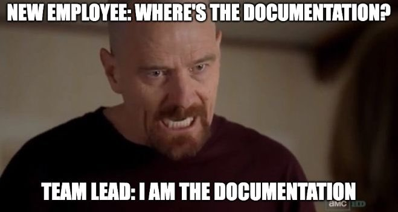

# Designsystem - fra zero til hero

Et par disclaimers: jeg var strengt tatt ikke helt ingenting, eller zero, når jeg begynte denne læringsreisen. Jeg har jobbet med og brukt designsystemer tidligere i ulike former og fasonger, men har aldri virkelig gått i dybden på hvilke tanker og valg som inngår i designet av et skikkelig bra designsystem. Om jeg er blitt noen hero er også høyst diskutabelt, men at jeg har fått en brukbar forståelse for do's and dont's' på feltet er ikke å tøye strikken.

Til slutt før vi begynner: hvor ok språkrådet er med at jeg skriver zero til hero på norsk er jeg usikker på, men når Disney kunne gjøre det i sin 1997-klassiker, Herkules, så må det være greit at også jeg gjør det.


## Introduksjon

### Litt om hva dette ikke er (og er)

Dette er ikke en oppskrift på hvordan man bygger et designsystem. Er du ute etter det, finnes det mange gode inspirasjonskilder der ute, og her er noen av dem:

- [Her](https://storybook.js.org/tutorials/design-systems-for-developers/) har storybook oppsummert veldig mye godt og grunnleggende om hva de mener et designsystem bør være
- [Her](https://main--66b4b3beb91603ed0ab5c45e.chromatic.com/?path=/docs/docs-getting-started--docs) er portalen til Aksel, NAV sin verktøykasse for produktutvikling, som også inkluderer, (og i stor grad _er_ spør du meg), et designsystem.
- [Her](<(https://www.designsystemet.no/)>) har du Designsystemet fra Digdir.
- [Her](https://github.com/johanmha/yadsy) finner du mitt eget quick and dirty oppsett av et minimalt designsystem, yadsy. Det er et godt utgangspunkt med tanke på struktur og CI/CD.

Det denne bloggserien i to deler er, er i stedet en samling betraktninger på hva som gjør et godt designsystem til et godt designsystem.

### Hva snakker vi om

Ordet designsystem kan strengt tatt brukes om flere ting. I designverden kan det for eksempel være et design satt opp i eksempelvis Figma, som beskriver alt fra de minste bestanddelene som farger og fonter, til grunnkomponenter som knapper og inputfelter, til større sammenstillinger som kort, og hele sider.

Slik sett er det nært beslektet designsystemet vi snakker om i denne bloggserien: designsystemet brukt i frontend-utvikling. [Det består i følge Storybook av](https://storybook.js.org/tutorials/design-systems-for-developers/react/en/introduction/)

- komponenter
- design tokens
- dokumentasjon.

Man kan også se totalen av designets spesifikasjon i figma og designsystemet som et designsystem, og et designsystem vil i alle tilfeller ofte bygge på et design(system) i nettopp Figma. Som vanlig er språket ikke uten sine dobbeltbetydninger og usikkerheter. I denne bloggserien er et designsystem herfra og ut brukt for å beskrive ca det som Storybook definerer et designsystem som. I tilfellet for Aksel fra NAV og Designsystemet fra Digdir, brukes det om det totale systemet, selv om det også er upresist på alle slags måter. Men jaja, det bør være tålelig forståelig utifra konteksten.

### Prosessen

Jeg begynte med å sette opp mitt eget system uten å tenke noe særlig på hva som er lurt og hva som er skikkelig dumt. Med hjelp av min foretrukne språkmotor kom det opp fort og gæli, og er i dag ute som et konsept-system på NPM. Resultatet ble yadsy (yet another design system), som kan sjekkes opp [her](https://github.com/johanmha/yadsy).

Deretter undersøkt jeg norske state-of-the-art designsystemer fra [NAV](https://main--66b4b3beb91603ed0ab5c45e.chromatic.com/?path=/docs/docs-getting-started--docs) og [Digdir](https://www.designsystemet.no/). Jeg har dykket ned i dokumentasjon og kode for å forstå hvilke valg de har tatt, hva de har gjort, og hva de ikke har gjort.


Med basis i mitt eget enkle system, har jeg dermed kunnet se hva du får når du tenker og grubler på arkitekturen, heller enn å bare kaste noe på veggen og ser hva som skjer.

## Hva er poenget med et designsystem?

Det er i hovedsak to behov et designsystem dekker:

1. Det skal spare tid
2. Det skal sikre konsistent og god brukeropplevelse.

I tillegg kan man argumentere for at et hovedpunkt er å sikre overholdelse av krav og regelverk (les: WCAG/universell utforming). Jeg har dyttet det inn under brukeropplevelse, men det kunne vært under begge.

I resten av bloggserien skal vi se på hvilke metoder og valg som kan gjøres for å dekke de to grunnbehovene.

## Tid er penger

Først ser vi på punkt nummer 1: hvordan et designsystem kan spare tid.


### Gode hjelpere

Noen ord om gode verktøy som vil spare tid i utvikling, vedlikehold og bruk av et designsystem.

#### Storybook

En slags de facto standard i bygging av designsystem. Navet i designsystemet (pun intended), med funksjonalitet for dokumentasjon og testing. [Her](https://storybook.js.org/) er landingssiden deres om du er for lat til å søke.

#### Chromatic

[Chromatic](https://www.chromatic.com/) er også en slags de facto standard, men for visuell testing av komponentene i et designsystem. Står litt mer om det [lenger nede her](#så-enkelt-som-mulig-å-vedlikeholde).

#### TypeScript

TypeScript hjelper både i bygging og bruk av et designsystem. I Aksel og Designsystemet støtter det utvikling og bruk gjennom blant annet å gi IDE-funksjonalitet, sikre konsistent bruk, trygge vedlikehold og som levende dokumentasjon av koden.

#### Kommandolinjeverktøy (CLI fra nå av)

Et CLI kan hjelpe utviklere i bruk av designsystemet. [Aksel inkluderer et](https://aksel.nav.no/grunnleggende/kode/kommandolinje) som blant annet kan hjelpe deg med å automigrere mellom major-versjoner. [Designsystemet har et](https://www.npmjs.com/package/@digdir/designsystemet) som for eksempel hjelper deg å sette opp nye temaer.

#### Linting (lint/style-lint)

Håndhever at utviklere bruker designsystemet som tilsiktet. Snakker litt mer om style-lint under [god brukeropplevelse](#felles-avsender). Hverken Designsystemet eller Aksel har en standard linter (Aksel har style-linter). Hvorfor er jeg ikke sikker på, men kan være

- det er for mye styr å få til noe som gir verdi på tvers av mange team
- man ikke har kommet seg så langt
- TypeScript gjør nok
- det bare er en dum idé 🤷🏼‍♂️

Del gjerne om du har mer innsikt på akkurat det.

### Dokumentasjon

Tydelig dokumentasjon er essensielt for bred adopsjon. Det må være enkelt å forstå hvordan man bruker komponenter, styler dem, setter opp temaer, osv., ellers lager utviklerne dem heller selv. Dette fungerer heller ikke:



Her kommer [Storybook](https://storybook.js.org/) inn. Gjennom [stories](https://storybook.js.org/docs/writing-stories) kan du vise frem til utviklere hvordan en komponent skal brukes, og sette opp eksempler på ulike scenarioer. Jeg liker særlig godt hvordan Designsystemet har laget en egen docs for hver enkelt komponent, som gir en overordnet historie om hvordan den skal brukes. Dette er lettlest og forståelig, og samler mye kunnskap på én side. [Her](https://storybook.designsystemet.no/?path=/docs/komponenter-button--docs) et eksempel fra knappen deres.

Det er også naturlig å legge inn overordnet dokumentasjon om saker som bruk og beste praksiser i Storybook. Her har dog både Nav og Digdir tatt det et steg lenger, og laget sine egne web-sider med et stort økosystem av dokumentasjon. Hos [Designsystemet](https://www.designsystemet.no) finner du kom-i-gang-informasjon for både [designere](https://www.designsystemet.no/grunnleggende/for-designere/kom-i-gang), og [utviklere](https://www.designsystemet.no/grunnleggende/for-designere/kom-i-gang), samt [god praksis](https://www.designsystemet.no/god-praksis). Nav er ikke noe dårligere og har blant annet sin [blogg](https://aksel.nav.no/produktbloggen) med erfaringer, kunnskap og oppdateringer.

Det er ingen overdrivelse å si at Designsystemet og Aksel tar sin dokumentasjon alvorlig, og det er nok et hint om viktigheten av den.

### Gjennbrukbart og konfigurerbart

For at et designsystem skal kunne spare tid for utviklere, må det også faktisk brukes utviklere. Da må det være brukbart på tvers av mange ulike team, med mange ulike behov og spesialtilfeller, og med mange utviklere som skal ha en god utvikleropplevelse. For at det skal være mulig må du ha flere ting, blant annet:

- Gjenbrukbarhet
- Konfigurerbarhet

Under dette må man blant annet finne balansen mellom å være generell og å være spesiell. Her har for eksempel Aksel funnet en fin balanse når de har laget et standardisert sett med breakpoints til responsive design. De har også utviklet en egen type som kan ta inn ulike design tokens basert på hvilken skjermbredde man er på. På den måten sikrer man at man har et felles system å jobbe etter, samtidig som det er ganske mye spillerom for hvert enkelt team. Hvis noen absolutt må ha noe utenfor dette settet, så kan man alltids lage sitt eget breakpoint med sine egne regler. På denne måten er det både gjenbrukbart rett ut av boksen, samtidig som det ikke blokkerer å håndtere spesialtilfeller.

Et annet eksempel på å gjøre komponenter konfigurerbare er polymorfi. Hva er det? Kort fortalt at du kan endre hvilket html-element en komponent rendres ut som. Det klassiske eksempelet er å bruke en Button-komponent som en lenke, fordi du vil bruke noe som ser ut som en knapp til å navigere til en ny side. Det bedrer universell utforming, ettersom en a-tag er semantisk korrekt element for oppgaven. Det kunne for eksempel vært slik

```jsx
<Button as="a" href="/kontakt-oss" variant="primary">
  Kontakt oss
</Button>
```

i stedet for slik

```jsx
<Button onClick={() => (window.location.href = '/kontakt-oss')} variant="primary">
  Kontakt oss
</Button>
```

Designsystemet støtter dette med [asChild](https://www.designsystemet.no/grunnleggende/for-utviklere/komposisjon) gjennom [Radix sin Slot-komponent](https://www.radix-ui.com/primitives/docs/utilities/slot), mens Aksel gjør det med sin egen [OverridableComponent](https://aksel.nav.no/grunnleggende/kode/overridablecomponent). Felles for de begge er at de sikrer typesikkerhet for komponenten, i motsetning til hva du får med enklere implementasjoner.

Som et siste notis, er det å finne balansen på dette feltet antakelig det aller vanskeligste i et designsystem. Blir det for generelt er det ikke brukbart. Blir det for spesielt blir det kaos både å bruke og vedlikeholde. Blir det for konfigurerbart risikerer du at utviklere gjør ting de ikke burde, og ødelegger opplevelsen av _et_ budskap fra _én_ avsender. Det er her håndverk og erfaring virkelig kommer til sin rett.

### Så enkelt som mulig å vedlikeholde

Desto mer du har og desto mer komplekst det er, desto mer krever det å vedlikeholde. Et designsystem er ikke et unntak fra denne regelen. Én ting er å balansere støtte for konfigurerbarhet og spesialtilfeller opp mot kompleksiteten du får på kjøpet. Et annet moment er å gjøre det enklest mulig å fange feil som introduseres. Da er tester verktøyet. Automatiske enhetstester kan og bør brukes, men også visuelle tester kan ha stor verdi.

Årsaken er at automatiske tester ikke kan fange opp alt som kan gå galt med en komponent i alle sine tilstander. Å ha det som mål ville være både tidkrevende å implementere og i tillegg føre med seg sin egen kompleksitet. [Chromatic](https://www.chromatic.com/), et mye brukt visuelt testverktøy, baserer seg på snapshots av eksempelvis en komponents samlede tilstander. Et snapshot genereres for eksempel før en pull request, og det sjekkes automatisk om noe er endret. Om noe er endret fra forrige snapshot til dette, varsles mennesket i loopen, og man kan ta stilling til om dette er endring som forventet. Dette er for eksempel implementert i Designsystemet, og et oppsett kan se ut som [dette for Button-komponenten](https://github.com/digdir/designsystemet/blob/next/packages/react/src/components/Button/Button.chromatic.tsx).

En annen essensiell bit av et vedlikeholdbart designsystem er TypeScript. Vi går ikke noe nærmere inn på alle fordelene med TypeScript her, annet enn det jeg [oppsummerte kort over her](#TypeScript). Du kan eventuelt grave litt i for eksempel [denne](https://github.com/navikt/aksel/blob/main/%40navikt/core/react/src/button/Button.tsx) eller [denne](https://github.com/digdir/designsystemet/blob/next/packages/react/src/components/Button/Button.tsx) koden om du er nysgjerrig.

## Det var del 1

I del 2 som du finner [her](./designsystem_zero_til_hero_del2.md), kommer brukervennlighet og konklusjonen.
